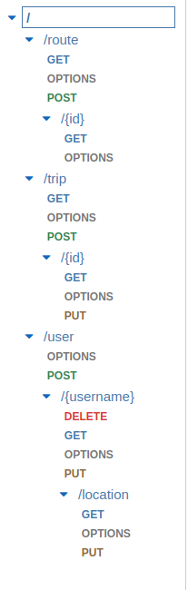

# API Gateway Routes

This repository stores all of the API Gateway Lambda Handler source code. 

The API Gateway routes are as follows:




The corresponding Lambda functions can be found below:

```
├── route
│   ├── drifter-get-route-id.py
│   ├── drifter-get-route.py
│   └── drifter-post-route.py
├── trip
│   ├── drifter-get-trip-id.py
│   ├── drifter-get-trip.py
│   ├── drifter-post-trip.py
│   └── drifter-put-trip-id.py
├── user
│   ├── drifter-delete-user-username.py
│   ├── drifter-get-user-username-location.py
│   ├── drifter-get-user-username.py
│   ├── drifter-post-user.py
│   ├── drifter-put-user-username-location.py
│   └── drifter-put-user-username.py
└── user_pool_events
    └── drifter-new-user.py
```

On every new commit to main, the pipeline will push whatever is in GitHub to AWS.

`drifter-new-user.py` is triggered by a new user creation in the user pool
